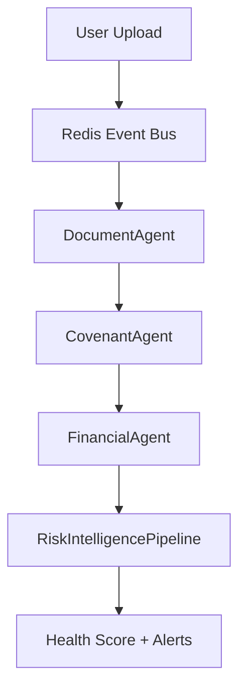

# Architecture Images

> This file is a placeholder for architecture diagrams and visual assets.

## Diagrams to Create

For portfolio/case study use:

1. **System Architecture Diagram** — the 5-layer ASCII art from `02-System-Architecture/High Level Architecture.md` rendered as a visual SVG
2. **Document Pipeline Flow** — Upload → Redis → DocumentWorkflow → agents → DB
3. **Risk Intelligence Pipeline** — the 6-engine sequential flow
4. **Hybrid GraphRAG** — 3-source retrieval architecture
5. **Database ER Diagram** — the 19-table entity relationship

## Tools

- **Excalidraw** — for hand-drawn style diagrams (recommended for portfolio)
- **Mermaid** — for code-rendered flowcharts
- **draw.io** — for formal architecture diagrams

## Mermaid Quick Reference (for Architecture.md embedding)

